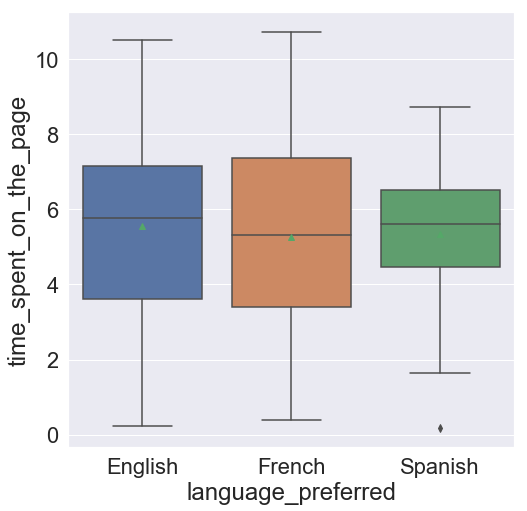

# Problem Statement

An online news portal aims to expand its business by acquiring new subscribers. Every visitor to the website takes certain actions based on their interest. The company plans to analyze these interests and wants to determine whether a new feature will be effective or not. Companies often analyze users' responses to two variants of a product to decide which of the two variants is more effective. This experimental technique is known as a/b testing that is used to determine whether a new feature attracts users based on a chosen metric.

Suppose you are hired as a Data Scientist in E-news Express. The design team of the company has created a new landing page. You have been assigned the task to decide whether the new landing page is more effective to gather new subscribers. Suppose you randomly selected 100 users and divided them equally into two groups. The old landing page is served to the first group (control group) and the new landing page is served to the second group (treatment group). Various data about the customers in both groups are collected in 'abtest.csv'. Perform the statistical analysis to answer the following questions using the collected data.

1. Explore the dataset and extract insights using Exploratory Data Analysis.

2. Do the users spend more time on the new landing page than the existing landing page?

3. Is the conversion rate (the proportion of users who visit the landing page and get converted) for the new page greater than the conversion rate for the old page?

4. Does the converted status depend on the preferred language? [Hint: Create a contingency table using the pandas.crosstab() function]

5. Is the time spent on the new page same for the different language users?


*Consider a significance level of 0.05 for all tests.

The  idea  behinding  answering  these  questions  is  to  decide  whether  the  new  page  is  effective  enough  to  gather  new subscribers for the news portal. We will perform the statistical analysis on the collected data to make the business decision.


# Data Dictionary

1. user_id - This represents the user ID of the person visiting the website.

2. group - This represents whether the user belongs to the first group (control) or the second group (treatment).

3. landing_page - This represents whether the landing page is new or old.

4. time_spent_on_the_page - This represents the time (in minutes) spent by the user on the landing page.

5. converted - This represents whether the user gets converted to a subscriber of the news portal or not.

6. language_preferred - This represents the language chosen by the user to view the landing page.

## Import all the necessary libraries


```python
import numpy as np
import pandas as pd
from matplotlib import pyplot as plt
import seaborn as sns
```

## 1. Explore the dataset and extract insights using Exploratory Data Analysis.

### Exploratory Data Analysis - Step by step approach

Typical Data exploration activity consists of the following steps:
1.  Importing Data
2.  Variable Identification
3.  Variable Transformation/Feature Creation
4.  Missing value detection
5.  Univariate Analysis
6.  Bivariate Analysis

### Reading the Data into a DataFrame


```python
df = pd.read_csv('abtest.csv')
```

### View the first and last 5 rows of the dataset


```python
df.head()
```


<div>
<style scoped>
    .dataframe tbody tr th:only-of-type {
        vertical-align: middle;
    }

    .dataframe tbody tr th {
        vertical-align: top;
    }

    .dataframe thead th {
        text-align: right;
    }
</style>
<table border="1" class="dataframe">
  <thead>
    <tr style="text-align: right;">
      <th></th>
      <th>user_id</th>
      <th>group</th>
      <th>landing_page</th>
      <th>time_spent_on_the_page</th>
      <th>converted</th>
      <th>language_preferred</th>
    </tr>
  </thead>
  <tbody>
    <tr>
      <th>0</th>
      <td>546592</td>
      <td>control</td>
      <td>old</td>
      <td>3.48</td>
      <td>no</td>
      <td>Spanish</td>
    </tr>
    <tr>
      <th>1</th>
      <td>546468</td>
      <td>treatment</td>
      <td>new</td>
      <td>7.13</td>
      <td>yes</td>
      <td>English</td>
    </tr>
    <tr>
      <th>2</th>
      <td>546462</td>
      <td>treatment</td>
      <td>new</td>
      <td>4.40</td>
      <td>no</td>
      <td>Spanish</td>
    </tr>
    <tr>
      <th>3</th>
      <td>546567</td>
      <td>control</td>
      <td>old</td>
      <td>3.02</td>
      <td>no</td>
      <td>French</td>
    </tr>
    <tr>
      <th>4</th>
      <td>546459</td>
      <td>treatment</td>
      <td>new</td>
      <td>4.75</td>
      <td>yes</td>
      <td>Spanish</td>
    </tr>
  </tbody>
</table>
</div>


```python
df.tail()
```


<div>
<style scoped>
    .dataframe tbody tr th:only-of-type {
        vertical-align: middle;
    }

    .dataframe tbody tr th {
        vertical-align: top;
    }

    .dataframe thead th {
        text-align: right;
    }
</style>
<table border="1" class="dataframe">
  <thead>
    <tr style="text-align: right;">
      <th></th>
      <th>user_id</th>
      <th>group</th>
      <th>landing_page</th>
      <th>time_spent_on_the_page</th>
      <th>converted</th>
      <th>language_preferred</th>
    </tr>
  </thead>
  <tbody>
    <tr>
      <th>95</th>
      <td>546446</td>
      <td>treatment</td>
      <td>new</td>
      <td>5.15</td>
      <td>no</td>
      <td>Spanish</td>
    </tr>
    <tr>
      <th>96</th>
      <td>546544</td>
      <td>control</td>
      <td>old</td>
      <td>6.52</td>
      <td>yes</td>
      <td>English</td>
    </tr>
    <tr>
      <th>97</th>
      <td>546472</td>
      <td>treatment</td>
      <td>new</td>
      <td>7.07</td>
      <td>yes</td>
      <td>Spanish</td>
    </tr>
    <tr>
      <th>98</th>
      <td>546481</td>
      <td>treatment</td>
      <td>new</td>
      <td>6.20</td>
      <td>yes</td>
      <td>Spanish</td>
    </tr>
    <tr>
      <th>99</th>
      <td>546483</td>
      <td>treatment</td>
      <td>new</td>
      <td>5.86</td>
      <td>yes</td>
      <td>English</td>
    </tr>
  </tbody>
</table>
</div>


### Understand the shape of the dataset


```python
df.shape
```


    (100, 6)


The dataset has 100 rows and 6 columns.

### Check the data types of the columns for the dataset


```python
df.info()
```

    <class 'pandas.core.frame.DataFrame'>
    RangeIndex: 100 entries, 0 to 99
    Data columns (total 6 columns):
     #   Column                  Non-Null Count  Dtype  
    ---  ------                  --------------  -----  
     0   user_id                 100 non-null    int64  
     1   group                   100 non-null    object 
     2   landing_page            100 non-null    object 
     3   time_spent_on_the_page  100 non-null    float64
     4   converted               100 non-null    object 
     5   language_preferred      100 non-null    object 
    dtypes: float64(1), int64(1), object(4)
    memory usage: 4.8+ KB
    

* There are total 100 non-null observations in each of the columns.

* There are 6 columns named **'user_id', 'group', 'landing_page', 'time_spent_on_the_page', 'converted', 'language_preferred'** whose data types are **int64, object, object, float64, object, object** respectively.


* 'group', 'landing_page', 'converted', and 'language_preferred' are objects, we can change them to categories.

### Fixing the data types

`converting "objects" to "category" reduces the space required to store the DataFrame. It also helps in analysis`


```python
df.group = df.group.astype('category')
df['landing_page'] = df['landing_page'].astype('category')
df['converted'] = df['converted'].astype('category')
df['language_preferred'] = df['language_preferred'].astype('category')
```


```python
df.info()
```

    <class 'pandas.core.frame.DataFrame'>
    RangeIndex: 100 entries, 0 to 99
    Data columns (total 6 columns):
     #   Column                  Non-Null Count  Dtype   
    ---  ------                  --------------  -----   
     0   user_id                 100 non-null    int64   
     1   group                   100 non-null    category
     2   landing_page            100 non-null    category
     3   time_spent_on_the_page  100 non-null    float64 
     4   converted               100 non-null    category
     5   language_preferred      100 non-null    category
    dtypes: category(4), float64(1), int64(1)
    memory usage: 2.5 KB
    

### Check for missing values


```python
df.isna().sum()   #null value check
```


    user_id                   0
    group                     0
    landing_page              0
    time_spent_on_the_page    0
    converted                 0
    language_preferred        0
    dtype: int64


* There are no missing values in any of the column

### Five point summary of continuous variables


```python
df.describe(include = ['float64']).T
```


<div>
<style scoped>
    .dataframe tbody tr th:only-of-type {
        vertical-align: middle;
    }

    .dataframe tbody tr th {
        vertical-align: top;
    }

    .dataframe thead th {
        text-align: right;
    }
</style>
<table border="1" class="dataframe">
  <thead>
    <tr style="text-align: right;">
      <th></th>
      <th>count</th>
      <th>mean</th>
      <th>std</th>
      <th>min</th>
      <th>25%</th>
      <th>50%</th>
      <th>75%</th>
      <th>max</th>
    </tr>
  </thead>
  <tbody>
    <tr>
      <th>time_spent_on_the_page</th>
      <td>100.0</td>
      <td>5.3778</td>
      <td>2.378166</td>
      <td>0.19</td>
      <td>3.88</td>
      <td>5.415</td>
      <td>7.0225</td>
      <td>10.71</td>
    </tr>
  </tbody>
</table>
</div>


* The time spent on the landing page is less than 11 minutes
* The mean time spent on the landing page is approximately 5 minutes.
* The median time spent on the landing page is approximately 5 minutes.

### Summary of categorical variables


```python
df.describe(include = ['category']).T
```


<div>
<style scoped>
    .dataframe tbody tr th:only-of-type {
        vertical-align: middle;
    }

    .dataframe tbody tr th {
        vertical-align: top;
    }

    .dataframe thead th {
        text-align: right;
    }
</style>
<table border="1" class="dataframe">
  <thead>
    <tr style="text-align: right;">
      <th></th>
      <th>count</th>
      <th>unique</th>
      <th>top</th>
      <th>freq</th>
    </tr>
  </thead>
  <tbody>
    <tr>
      <th>group</th>
      <td>100</td>
      <td>2</td>
      <td>treatment</td>
      <td>50</td>
    </tr>
    <tr>
      <th>landing_page</th>
      <td>100</td>
      <td>2</td>
      <td>old</td>
      <td>50</td>
    </tr>
    <tr>
      <th>converted</th>
      <td>100</td>
      <td>2</td>
      <td>yes</td>
      <td>54</td>
    </tr>
    <tr>
      <th>language_preferred</th>
      <td>100</td>
      <td>3</td>
      <td>Spanish</td>
      <td>34</td>
    </tr>
  </tbody>
</table>
</div>


```python
df['group'].value_counts()
```


    treatment    50
    control      50
    Name: group, dtype: int64


```python
df['landing_page'].value_counts()
```


    old    50
    new    50
    Name: landing_page, dtype: int64


```python
df['converted'].value_counts()
```


    yes    54
    no     46
    Name: converted, dtype: int64


```python
df['language_preferred'].value_counts()
```


    Spanish    34
    French     34
    English    32
    Name: language_preferred, dtype: int64


* There are 100 unique users.
* There are 2 unique groups - control and treatment. Each group consists of 50 users.
* There are 2 landing_pages - new and old.
* Overall, 54 users get converted and 46 users do not get converted after visiting the landing page.
* There are 3 unique preferred languages - English, French, and Spanish.

### Univariate Analysis


```python
# Let us write a function that will help us create boxplots and histograms for any input numerical 
# variables.
# This function takes the numerical column as the input and returns the boxplots and histograms for the variable.
# This will also help us write faster and cleaner code.
def histogram_boxplot(data, xlabel = None, title = None, font_scale=2, figsize=(15,7), bins = None):
    """ Boxplot and histogram combined
    data: 1-d data array
    xlabel: xlabel 
    title: title
    font_scale: the scale of the font (default 2)
    figsize: size of fig (default (9,8))
    bins: number of bins (default None / auto)

    
    """
    mean = np.mean(data)

    sns.set(font_scale = font_scale) # setting the font scale of the seaborn
    f2, (ax_box2, ax_hist2) = plt.subplots(2, sharex = True, gridspec_kw = {"height_ratios": (.25, .75)}, figsize = figsize) # creating the 2 subplot
    sns.boxplot(x = data, ax = ax_box2, showmeans = True, color = "violet") # boxplot will be created and a star will indicate the mean value of the column
    sns.histplot(x = data, kde = False, ax = ax_hist2, bins = bins, palette="winter") if bins else sns.histplot(x = data, kde = False, ax = ax_hist2, color = "lightblue") # histogram will be made
    ax_hist2.axvline(mean, color = 'g', linestyle = '--') # mean will shown as vertical line in the histogram
    if xlabel: ax_hist2.set(xlabel = xlabel) # xlabel
    if title: ax_box2.set(title = title) # title of the graph
    plt.show() # display the graph
```

#### Time spent on the page


```python
histogram_boxplot(df["time_spent_on_the_page"])
```


    

    


* The time spent on the page looks to have a fairly normal distribution.
* There are no outliers in this column.


```python
# Function to create barplots that indicate percentage for each category.

def perc_on_bar(plot, feature):
    '''
    plot
    feature: categorical feature
    the function won't work if a column is passed in hue parameter
    '''
    total = len(feature) # length of the column
    for p in ax.patches:
        percentage = '{:.1f}%'.format(100 * p.get_height()/total) # percentage of each class of the category
        x = p.get_x() + p.get_width() / 2 - 0.05 # width of the plot
        y = p.get_y() + p.get_height() + 0.5         # height of the plot
        ax.annotate(percentage, (x, y), size = 24) # annotate the percentage 
    plt.show() # show the plot
```

#### Group


```python
plt.figure(figsize=(8,8))
ax = sns.countplot(x = df["group"],palette='winter')
perc_on_bar(ax,df["group"])
```


    

    


* The distribution of observations across groups are the same.

#### Landing page


```python
plt.figure(figsize=(8,8))
ax = sns.countplot(x = df["landing_page"],palette='winter')
perc_on_bar(ax,df["landing_page"])
```


    

    


* The distribution of observations across the two landing pages are same.

#### Converted


```python
plt.figure(figsize=(8,8))
ax = sns.countplot(x = df["converted"],palette='winter')
perc_on_bar(ax,df["converted"])
```


    

    


* 54% of the users get converted after visiting the landing page.
* 46% of the users do not get converted after visiting the landing page.

#### Preferred language


```python
plt.figure(figsize=(8,8))
ax = sns.countplot(x=df["language_preferred"],palette='winter')
perc_on_bar(ax,df["language_preferred"])
```


    

    


* The distribution of observations across various preferred languages is fairly uniform.

### Bivariate Analysis

#### Landing page vs Time spent on the page


```python
plt.figure(figsize=(9, 9))
sns.histplot(data = df, x = 'time_spent_on_the_page', hue = 'landing_page')
plt.show()
```


    

    


* Overall, the time spent on the new page seems to be greater than the time spent on the old page.

#### Conversion status vs Time spent on the page


```python
plt.figure(figsize=(8,8))
sns.histplot(data = df, x = 'time_spent_on_the_page', hue = 'converted')
plt.show()
```


    

    


* Overall, the users who get converted seem to spend more time on the page. 

#### Preferred language vs Time spent on the page


```python
plt.figure(figsize=(8,8))
sns.boxplot(x = 'language_preferred', y = 'time_spent_on_the_page', showmeans = True, data = df)
plt.show()
```


    

    


* The median time spent by the different language users are approximately equal.
* The mean time spent by the different language users are approximately equal.

## 2. Do the users spend more time on the new landing page than the existing landing page?


```python
# visual analysis of the time spent on the new page
# and the time spent on the old page
plt.figure(figsize=(8,6))
sns.boxplot(x = 'landing_page', y = 'time_spent_on_the_page', data = df)
plt.show()
```


    

    


By observing the above plot, we can say that overall people spent more times on the new page than the old age. Let's perform a hypothesis test to see if there are enough statistical evidence to support our observation.

## Step 1: Define the null and alternate hypotheses

$H_0:$ The mean time spent by the users on the new page is equal to the mean time spent by the users on the old page.

$H_a:$ The mean time spent by the users on the new page is greater than the mean time spent by the users on the old page.

Let $\mu_1$ and $\mu_2$ be the mean time spent by the users on the new and old page respectively.

Mathematically, the above formulated hypotheses can be written as:

$H_0: \mu_1 = \mu_2$

$H_a: \mu_1 > \mu_2$

## Step 2: Select Appropriate test

This is a one-tailed test concerning two population means from two independent populations. As the population standard deviations are unknown, the two sample independent t-test will be the appropriate test for this problem.

## Step 3: Decide the significance level

As given in the problem statement, we select α = 0.05.

## Step 4: Collect and prepare data


```python
time_spent_new = df[df['landing_page'] == 'new']['time_spent_on_the_page']
time_spent_old = df[df['landing_page'] == 'old']['time_spent_on_the_page']
```


```python
time_spent_new;
```


```python
print('The sample standard deviation of the time spent on the new page is:', round(time_spent_new.std(),2))
print('The sample standard deviation of the time spent on the old page is:', round(time_spent_old.std(),2))
```

    The sample standard deviation of the time spent on the new page is: 1.82
    The sample standard deviation of the time spent on the old page is: 2.58
    

As the sample standard deviations are different, the population standard deviations may be assumed to be different.

## Step 5: Calculate the p-value


```python
# import the required function
from scipy.stats import ttest_ind
# find the p-value
test_stat, p_value = ttest_ind(time_spent_new, time_spent_old, equal_var = False)
print('The p-value is', p_value)
```

    The p-value is 0.0002784762450333098
    

## Step 6: Compare the p-value with $\alpha$


```python
# print the conclusion based on p-value
if p_value < 0.05:
    print(f'As the p-value {p_value} is less than the level of significance, we reject the null hypothesis.')
else:
    print(f'As the p-value {p_value} is greater than the level of significance, we fail to reject the null hypothesis.')
```

    As the p-value 0.0002784762450333098 is less than the level of significance, we reject the null hypothesis.
    

## Step 7:  Draw inference

Since the p-value is less than the 5% significance level, we reject the null hypothesis. Hence, we have enough statistical evidence to say that the mean time spent by the users on the new page is greater than the mean time spent by the users on the old page.

## 3. Is the conversion rate (the proportion of users who visit the landing page and get converted) for the new page greater than the conversion rate for the old page?


```python
# visual analysis of the conversion rate for the new page and the conversion rate for the old page
pd.crosstab(df['converted'],df['landing_page']).plot(kind="bar", figsize=(8,10),
                 stacked=True)
plt.legend()
plt.show()
```


    

    


By observing the above plot, we can say that overall the number of users who get converted is more for the new page than the old page. Let's perform a hypothesis test to see if there is enough statistical evidence to say that the conversion rate for the new page is greater than the old page.

## Step 1: Define the null and alternate hypotheses

$H_0:$ The conversion rate for the new page is equal to the conversion rate for the old page.

$H_a:$ The conversion rate for the new page is greater than the conversion rate for the old page.

Let $p_1$ and $p_2$ be the conversion rate for the new and old page respectively.

Mathematically, the above formulated hypotheses can be written as:

$H_0: p_1 = p_2$

$H_a: p_1 > p_2$

## Step 2: Select Appropriate test

This is a one-tailed test concerning two population proportions from two independent populations. Hence, the two proportion z-test will be the appropriate test for this problem.

## Step 3: Decide the significance level

As given in the problem statement, we select α = 0.05.

## Step 4: Collect and prepare data


```python
new_converted = df[df['group'] == 'treatment']['converted'].value_counts()['yes']
old_converted = df[df['group'] == 'control']['converted'].value_counts()['yes']
print('The numbers of converted users for the new and old pages are {0} and {1} respectively'.format(new_converted, old_converted))
n_control = df.group.value_counts()['control'] # number of users in the control group
n_treatment = df.group.value_counts()['treatment'] #number of users in the treatment group
print('The numbers of users served the new and old pages are {0} and {1} respectively'.format(n_control, n_treatment ))
```

    The numbers of converted users for the new and old pages are 33 and 21 respectively
    The numbers of users served the new and old pages are 50 and 50 respectively
    


```python
new_converted, old_converted
```


    (33, 21)


## Step 5: Calculate the p-value


```python
# import the required function
from statsmodels.stats.proportion import proportions_ztest

# find the p-value
test_stat, p_value = proportions_ztest([new_converted, old_converted] , [n_treatment, n_control], alternative = 'larger')
print('The p-value is', p_value)
```

    The p-value is 0.008026308204056278
    

## Step 6: Compare the p-value with $\alpha$


```python
# print the conclusion based on p-value
if p_value < 0.05:
    print(f'As the p-value {p_value} is less than the level of significance, we reject the null hypothesis.')
else:
    print(f'As the p-value {p_value} is greater than the level of significance, we fail to reject the null hypothesis.')
```

    As the p-value 0.008026308204056278 is less than the level of significance, we reject the null hypothesis.
    

## Step 7:  Draw inference

Since the p-value is less than the 5% significance level, we reject the null hypothesis. Hence, we have enough statistical evidence to say that the conversion rate for the new page is greater than the conversion rate for the old page.

## 4. Is the conversion and preferred language are independent or related?


```python
# visual analysis of the dependency between conversion status and preferred langauge
pd.crosstab(df['converted'],df['language_preferred']).plot(kind="bar", figsize=(8,12),
                 stacked=True)
plt.legend()
plt.show()
```


    

    


The distribution of conversion status for English and French language users is not uniformly distributed. Let's perform the hypothesis test to check whether we have enough statistical evidence to say that the conversion status and preferred language are independent or not.

## Step 1: Define the null and alternate hypotheses

$H_0:$ The converted status is independent of the preferred language.

$H_a:$ The converted status is not independent of the preferred language.

## Step 2: Select Appropriate test

This is a problem of Chi-square test of independence, concerning the two independent categorical variables, converted status and preferred language.

## Step 3: Decide the significance level

As given in the problem statement, we select α = 0.05.

## Step 4: Collect and prepare data


```python
# create the contingency table showing the distribution of two categorical variables
contingency_table = pd.crosstab(df['converted'], df['language_preferred'])
contingency_table
```


<div>
<style scoped>
    .dataframe tbody tr th:only-of-type {
        vertical-align: middle;
    }

    .dataframe tbody tr th {
        vertical-align: top;
    }

    .dataframe thead th {
        text-align: right;
    }
</style>
<table border="1" class="dataframe">
  <thead>
    <tr style="text-align: right;">
      <th>language_preferred</th>
      <th>English</th>
      <th>French</th>
      <th>Spanish</th>
    </tr>
    <tr>
      <th>converted</th>
      <th></th>
      <th></th>
      <th></th>
    </tr>
  </thead>
  <tbody>
    <tr>
      <th>no</th>
      <td>11</td>
      <td>19</td>
      <td>16</td>
    </tr>
    <tr>
      <th>yes</th>
      <td>21</td>
      <td>15</td>
      <td>18</td>
    </tr>
  </tbody>
</table>
</div>


## Step 5: Calculate the p-value


```python
#import the required function
from scipy.stats import chi2_contingency
# use chi2_contingency() to find the p-value
chi2, p_value, dof, exp_freq = chi2_contingency(contingency_table)
# print the p-value
print('The p-value is', p_value)
```

    The p-value is 0.21298887487543447
    

## Step 6: Compare the p-value with $\alpha$


```python
# print the conclusion based on p-value
if p_value < 0.05:
    print(f'As the p-value {p_value} is less than the level of significance, we reject the null hypothesis.')
else:
    print(f'As the p-value {p_value} is greater than the level of significance, we fail to reject the null hypothesis.')
```

    As the p-value 0.21298887487543447 is greater than the level of significance, we fail to reject the null hypothesis.
    

## Step 7:  Draw inference

Since the p-value is greater than the 5% significance level, we fail to reject the null hypothesis. Hence, we do not have enough statistical evidence to say that the converted status depends on the preferred language.

## 5. Is the time spent on the new page same for the different language users?


```python
# visual analysis of the mean time spent on the new page for different language users
plt.figure(figsize=(8,6))
# create a new DataFrame for users served the new page
df_new = df[df['landing_page'] == 'new']
sns.boxplot(x = 'language_preferred', y = 'time_spent_on_the_page', showmeans = True, data = df_new)
plt.show()
```


    

    


```python
# Checking the mean time spent on the new page for different language users
df_new.groupby(['language_preferred'])['time_spent_on_the_page'].mean()
```


    language_preferred
    English    6.663750
    French     6.196471
    Spanish    5.835294
    Name: time_spent_on_the_page, dtype: float64


The mean time spent on the new page by English users is a bit higher than the mean time spent by French and Spanish users, but we need to test if this difference is statistically significant or not. 

## Step 1: Define the null and alternate hypotheses

$H_0:$ The mean times spent on the new page by English, French, and Spanish users are equal.

$H_a:$ At least one of the mean times spent on the new page by English, French, and Spanish users is unequal.

## Step 2: Select Appropriate test

This is a problem, concerning three population means. One-way ANOVA could be the appropriate test here provided normality and equality of variance assumptions are verified.

* For testing of normality, Shapiro-Wilk’s test is applied to the response variable.

* For equality of variance, Levene test is applied to the response variable.

### Shapiro-Wilk’s test

We will test the null hypothesis

>$H_0:$ Time spent on the new page follows a normal distribution

against the alternative hypothesis

>$H_a:$ Time spent on the new page does not follow a normal distribution


```python
# Assumption 1: Normality
# import the required function
from scipy.stats import shapiro

# find the p-value
w, p_value = shapiro(df_new['time_spent_on_the_page']) 
print('The p-value is', p_value)
```

    The p-value is 0.8040016293525696
    

Since p-value of the test is very large than the 5% significance level, we fail to reject the null hypothesis that the response follows the normal distribution.

### Levene’s test

We will test the null hypothesis

>$H_0$: All the population variances are equal

against the alternative hypothesis

>$H_a$: At least one variance is different from the rest


```python
#Assumption 2: Homogeneity of Variance
#import the required function
from scipy.stats import levene
statistic, p_value = levene( df_new[df_new['language_preferred']=="English"]['time_spent_on_the_page'], 
                             df_new[df_new['language_preferred']=="French"]['time_spent_on_the_page'], 
                             df_new[df_new['language_preferred']=="Spanish"]['time_spent_on_the_page'])
# find the p-value
print('The p-value is', p_value)
```

    The p-value is 0.46711357711340173
    

Since the p-value is large than the 5% significance level, we fail to reject the null hypothesis of homogeneity of variances.

## Step 3: Decide the significance level

As given in the problem statement, we select α = 0.05.

## Step 4: Collect and prepare data


```python
time_spent_English = df_new[df_new['language_preferred']=="English"]['time_spent_on_the_page']
time_spent_French = df_new[df_new['language_preferred']=="French"]['time_spent_on_the_page']
time_spent_Spanish = df_new[df_new['language_preferred']=="Spanish"]['time_spent_on_the_page']
```


```python
len(time_spent_English),len(time_spent_French),len(time_spent_Spanish)
```


    (16, 17, 17)


## Step 5: Calculate the p-value


```python
# import the required function
from scipy.stats import f_oneway
# find the p-value
test_stat, p_value = f_oneway(time_spent_English, time_spent_French, time_spent_Spanish)
# print the p-value
print('The p-value is', p_value)
```

    The p-value is 0.43204138694325955
    

## Step 6: Compare the p-value with $\alpha$


```python
# print the conclusion based on p-value
if p_value < 0.05:
    print(f'As the p-value {p_value} is less than the level of significance, we reject the null hypothesis.')
else:
    print(f'As the p-value {p_value} is greater than the level of significance, we fail to reject the null hypothesis.')
```

    As the p-value 0.43204138694325955 is greater than the level of significance, we fail to reject the null hypothesis.
    

## Step 7:  Draw inference

Since the p-value is greater than the 5% significance level, we fail to reject the null hypothesis. Hence, we have enough statistical evidence to say that the mean times spent on the new page by English, French, and Spanish users are equal.

## Conclusion

- The users spend more time on the new page.

- The conversion rate for the new page is greater than the conversion rate of the old page. 

- The conversion status is independent of the preferred language.

- Based on the conclusions of the hypothesis tests, you can recommend that the news company should use the new landing page to gather more subscribers.

- The longer a visitor spends on a site, the more likely he/she is to convert. So, the business logic would appear to be: design a page that people spend time in, conversion will follow. 
